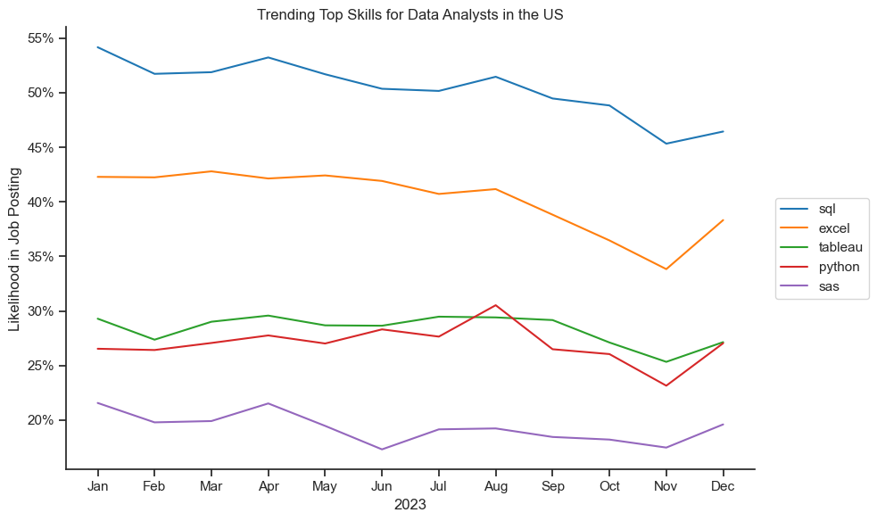
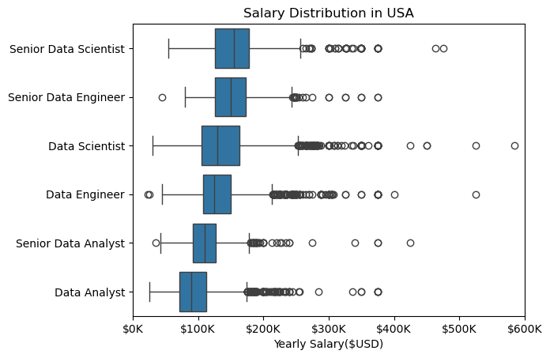
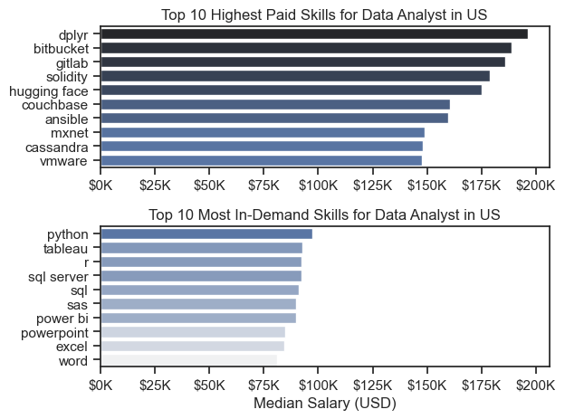
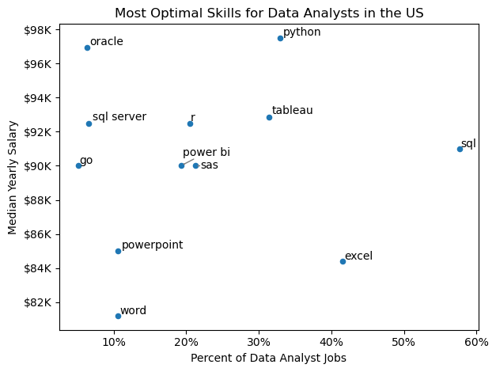

# The Analysis

## 1. What are the most demanded skills for the top 3 most popular data roles in the US?
View my notebook with detailed steps here:
[3.Skills_Demand_Analysis.ipynb](3_Project/3.Skills_Demand_Analysis.ipynb)

### Visualize Data
```python
fig, ax = plt.subplots(len(job_titles), 1)

sns.set_theme(style='ticks')

for i, job_title in enumerate(job_titles):
    df_plot = df_skills_perc[df_skills_perc['job_title_short'] == job_title].head(5)
    #df_plot.plot(kind='barh', x='job_skills', y='skill_percent', ax=ax[i], title=job_title)
    sns.barplot(data=df_plot, x='skill_percent', y='job_skills', ax=ax[i], hue='skill_count', palette='dark:b_r')
    ax[i].set_title(job_title)
    ax[i].set_ylabel('')
    ax[i].set_xlabel('')
    ax[i].get_legend().remove()
    ax[i].set_xlim(0,78)
    ax[i].legend().set_visible(False)
    
    for n,v in enumerate(df_plot['skill_percent']):
        ax[i].text(v+1, n, f'{v:.0f}%', va='center')

    ax[i].set_xticks([])

fig.suptitle('Likelihood of Skills Requested in US Job Postings', fontsize=15)
fig.tight_layout(h_pad=0.5)
plt.show()
```

### Results


# The Analysis
## 2. How are in-demand skills trending for Data Analysts?

### Visualize Data
```python
fig, ax = plt.subplots(figsize=(10, 6))
sns.lineplot(data=df_plot, dashes=False, palette='tab10')
sns.set_theme(style='ticks')
sns.despine()

plt.title('Trending Top Skills for Data Analysts in the US')
plt.ylabel('Likelihood in Job Posting')
plt.xlabel('2023')

from matplotlib.ticker import PercentFormatter
ax = plt.gca()
ax.yaxis.set_major_formatter(PercentFormatter(decimals=0))

ax.legend(loc='center left', bbox_to_anchor=(1.02,0.5))
plt.tight_layout()
plt.show()

```
### Results



# The Analysis
## 3. How well do the jobs and skills pay for Data Analysts?

### Visualize Data
```python
sns.boxplot(df_US_top6, x='salary_year_avg', y='job_title_short', order=job_order)
plt.title('Salary Distribution in USA')
plt.xlabel('Yearly Salary($USD)')
plt.ylabel('')

ticks_x = plt.FuncFormatter(lambda x, _: f'${int(x/1000)}K')
plt.gca().xaxis.set_major_formatter(ticks_x)
plt.xlim(0,600000)
plt.show()
```




## 3.1 Highest paid and Most Demanded Skills for Data Jobs

### Visualize Data
```python
fig, ax = plt.subplots(2,1)

sns.set_theme(style='ticks')

sns.barplot(data=df_DA_top_pay, x='median', y=df_DA_top_pay.index, ax=ax[0], hue='median', palette='dark:b_r') #it's saying apply the hue based on median value' palette='_r': reverse the palette
ax[0].legend().remove()
#df_DA_top_pay[::-1].plot(kind='barh', y='median', ax=ax[0], legend=False) #another way to reverse
ax[0].set_title('Top 10 Highest Paid Skills for Data Analyst in US')
ax[0].set_xlabel('')
ax[0].set_ylabel('')
ax[0].xaxis.set_major_formatter(plt.FuncFormatter (lambda x, _:f'${int(x/1000)}K'))

sns.barplot(data=df_DA_skills, x='median', y=df_DA_skills.index, ax=ax[1], hue='median', palette='light:b')
#df_DA_skills[::-1].plot(kind='barh', y='median', ax=ax[1], legend=False)
ax[1].legend().remove()
ax[1].set_xlim(ax[0].get_xlim()) #setting the same x-axis limit as the 1st one
ax[1].set_title('Top 10 Most In-Demand Skills for Data Analyst in US')
ax[1].set_xlabel('Median Salary (USD)')
ax[1].xaxis.set_major_formatter(plt.FuncFormatter (lambda x, _:f'${int(x/1000)}K'))
ax[1].set_ylabel('')

fig.tight_layout()
plt.show()
```

### Results

*Notes: Two separate bar graphs visualizing the highest paid skills and most in-demand skills for data analysts in the US.*


# The Analysis
## 4. What are the most optimal skills to learn for Data Analyst roles in the US?

### Visualize Data
```python
from adjustText import adjust_text

df_DA_skills_high_demand.plot(kind='scatter', x= 'skills_percent', y='median_salary')

#prepare texts for adjustText
texts = []
for i, text in enumerate(df_DA_skills_high_demand.index):
    texts.append(plt.text(df_DA_skills_high_demand['skills_percent'].iloc[i], df_DA_skills_high_demand['median_salary'].iloc[i], text))

# for i, txt in enumerate(df_DA_skills_high_demand.index):
#     plt.text(df_DA_skills_high_demand['skills_percent'].iloc[i], df_DA_skills_high_demand['median_salary'].iloc[i], txt) #1st two part: we're giving it the index for x and y using for loop

#Adjust text to avoid overlap
adjust_text(texts, arrowprops = dict(arrowstyle='->', color = 'gray'))


plt.title ('Most Optimal Skills for Data Analysts in the US')
plt.xlabel('Percent of Data Analyst Jobs')
plt.ylabel('Median Yearly Salary')
plt.tight_layout()

from matplotlib.ticker import PercentFormatter
ax = plt.gca()
ax.yaxis.set_major_formatter(plt.FuncFormatter(lambda y, pos: f'${int(y/1000)}K'))
ax.xaxis.set_major_formatter(PercentFormatter(decimals=0))

plt.show()
```


